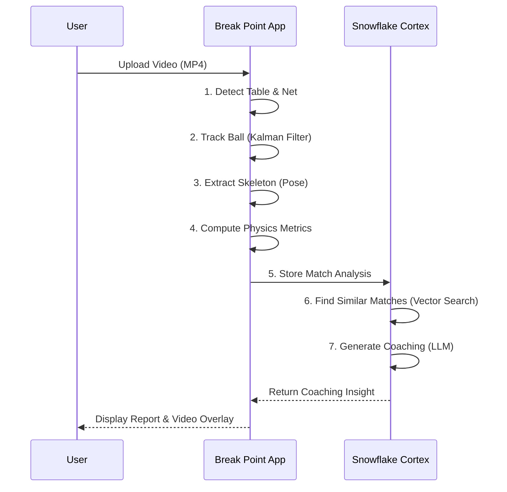

# Break Point 🏓

> **Performance & Mental Intelligence for Single-Sport Athletes**

## 📖 Table of Contents

1. [Product Overview (For Product Managers)](#-product-overview)
2. [User Guide (For Athletes/Customers)](#-user-guide)
3. [Technical Architecture (For Developers)](#-technical-architecture)

---

## 🚀 Product Overview

### The Problem

Single-sport athletes (Table Tennis, Tennis, Badminton, Squash) often lack the resources available to team sports—specifically, access to dedicated performance analysts and mental coaches. They are forced to rely on self-diagnosis, often missing the subtle behavioral and tactical patterns that lead to losses under pressure.

### The Solution

**Break Point** is an AI-powered system that democratizes elite-level analytics. It goes beyond simple unauthorized stat-tracking to provide a "forensic audit" of a player's performance, focusing on the mental and tactical breakdowns that decide close matches.

### Key Features

- **🧠 Mental Intelligence**: Tracks "Rhythm Consistency" and "Pressure Handling" to detect when a player becomes robotic or chaotic during critical points.
- **⚡ Tactical Grading**: Automatically evaluates shot choices (e.g., punishing a passive push on a high ball vs. playing safe on a low ball).
- **🦴 Biomechanical Audit**: Uses pose estimation to analyze knee bend, stance width, and shoulder rotation, correlating physical form with shot success.
- **🤖 AI Coaching (Cortex)**: A "Biomechanical Engine" persona that prescribes specific drills and corrections based on your unique match data.

---

## 👟 User Guide

### How to Use

Break Point is designed to be simple: **Film your match, run the tool, get the coaching.**

1.  **Record Your Match**: Use any standard camera (smartphone, GoPro) to record your game. Ensure the table is visible.
2.  **Run the Analysis**:

    ```bash
    # Basic Analysis
    python main.py --video "path/to/your/match_video.mp4"

    # Analysis + AI Coaching (Requires Snowflake)
    python main.py --video "path/to/your/match_video.mp4" --coach
    ```

3.  **Review Your Data**:
    - **Quick View**: Check the console output for immediate "Coaching Insights."
    - **Deep Dive**: Open `table_tennis_analysis.json` for raw metrics.
    - **Visuals**: Check the `output_videos/` folder for your processed match video with overlays.

### Understanding the Output

- **Rhythm Score**: Low variance is good (consistent). High variance means you are hesitating.
- **Tactical Score**: 0-100.
  - **>80**: You are making smart decisions (attacking high balls).
  - **<50**: You are missing opportunities or taking unnecessary risks.
- **Biomechanics**:
  - **Knees**: Should be < 140° (bent). > 150° means you are standing too straight.
  - **Stance**: Wider is better for stability.

### Usage Flow



---

## 🏗 Technical Architecture

### System Pipeline

The system follows a linear pipeline data flow, transforming raw video pixels into semantic coaching insights.

```mermaid
graph TD
    A[Raw Video Input] --> B(Perception Layer)
    B --> C{Stats Engine}

    subgraph "Perception Layer (Python/OpenCV)"
    B1[Ball Tracking<br/>(YOLO + 6D Kalman)]
    B2[Table Detection<br/>(TTNet / Hough)]
    B3[Pose Estimation<br/>(MediaPipe)]
    end

    B --> B1
    B --> B2
    B --> B3

    C --> D[Analysis JSON]
    D --> E[(Snowflake Data Cloud)]

    subgraph "Intelligence Layer (Snowflake)"
    E1[ANALYSIS_OUTPUT Table]
    E2[Vector Embedding<br/>(Cortex EMBED)]
    E3[AI Coach<br/>(Cortex COMPLETE)]
    end

    E --> E1
    E1 --> E2
    E2 --> E3
    E3 --> F[Final Coaching Report]
```

### Core Components

#### 1. Perception Layer (`main.py`)

- **Ball Tracking**: Uses a generic YOLO model fine-tuned for small objects, coupled with a **6D Kalman Filter** (x, y, vx, vy, ax, ay) to separate true ball movements from noise and handle occlusion.
- **Table Detection**: Supports **TTNet** (Deep Learning) for robust detection or a fallback **Manual Calibration** using RANSAC/Hough transforms (`TABLE_DETECTION.md`) for difficult lighting conditions.
- **Pose Estimation**: Extracts player skeletons to analyze biomechanics (knees, shoulders) at the exact moment of ball contact.

#### 2. Stats Engine (`HH/stats_engine.py`)

- **Physics**: Calculates ball speed, contact height relative to the net, and timing (Rising/Peak/Falling).
- **Tactics**: Derived metrics that grading decision quality.
  - _Example_: `calculate_aggression_opportunity()` checks if a player attacked a high ball (Good) or pushed it (Passive Error).

#### 3. Data & AI (`modules/llm_coach.py` & Snowflake)

- **Hybrid Storage**: Stores structured game data (JSON) in Snowflake's `VARIANT` column for flexibility.
- **Vector Search**: Uses `Cortex EMBED_TEXT_768` to turn match summaries into vectors. This allows the system to "remember" past matches and find patterns across history.
- **RAG Coaching**: The `CortexCoach` class retrieves the current match stats + 3 similar historical matches to prompt the LLM (`llama3.1-70b` or `K2-Think`) for context-aware advice.

### Installation & Setup

1. **Clone the repo**:
   ```bash
   git clone https://github.com/akhilm2223/TT-HACKCOLUMBAI.git
   ```
2. **Install Dependencies**:
   ```bash
   pip install -r requirements.txt
   ```
3. **Configure Snowflake (Optional for AI features)**:
   - Run `setup_snowflake.sql` in your Snowflake worksheet.
   - Set up `.env` with your credentials:
     ```env
     SNOWFLAKE_ACCOUNT=...
     SNOWFLAKE_USER=...
     SNOWFLAKE_PASSWORD=...
     KIMI_K2_THINKING_API_KEY=...
     ```

### Directory Structure

- `main.py`: Entry point for the video processing pipeline.
- `HH/`: Heuristic & Holistic stats engine.
- `modules/`: Database connectors and LLM coaching logic.
- `devfest_api/`: FastAPIs for serving frontend clients.

---

> **Note**: This project was built for the _TT-HACKCOLUMBAI_ hackathon to demonstrate the power of Agentic AI in sports analytics.
