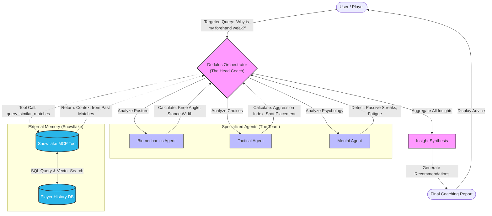
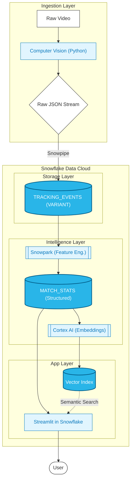

# Break Point AI - Architecture Diagrams

Below are the detailed Mermaid flowcharts for the DedalusLabs "Multi-Agent Coaching Brain" and the Snowflake "Intelligent Data Pipeline". You can view these directly in GitHub's markdown viewer.

## 1. DedalusLabs AI: Multi-Agent Coaching System

This diagram illustrates how the **Dedalus Orchestrator** receives a user query, delegates analysis to specialized sub-agents, cross-references with historical data via the Snowflake MCP tool, and synthesizes a final coaching report.



---

## 2. Snowflake: Intelligent Data Pipeline

This diagram shows the flow from raw video capture to the final user dashboard, highlighting how **VARIANT** data types, **Snowpark**, and **Cortex AI** work together within the Snowflake Data Cloud.


    Cortex -->|Store Vectors| VectorIndex

    StatsTable -->|Query Metrics| SiS
    VectorIndex -.->|Semantic Search Query| SiS

    %% Output
    User([End User / Coach])
    SiS -->|Interactive Dashboard| User

    %% Styling
    classDef source fill:#e1e1e1,stroke:#333,stroke-width:1px;
    classDef ingest fill:#f9d5e5,stroke:#333,stroke-width:1px;
    classDef snow fill:#29B5E8,stroke:#005c87,stroke-width:2px,color:white;
    classDef app fill:#FF4B4B,stroke:#990000,stroke-width:2px,color:white;

    class Video,CV,JSON source;
    class RawTable,StatsTable,VectorIndex snow;
    class Snowpark,Cortex ingest;
    class SiS app;
```
