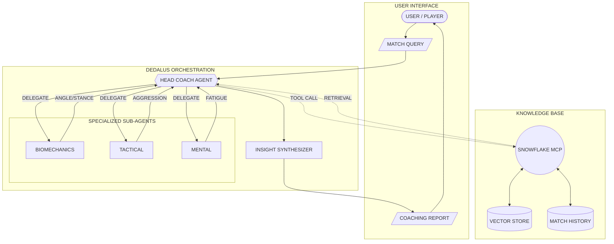
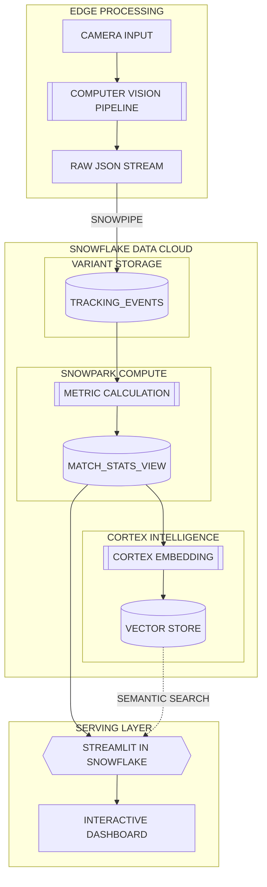

# Break Point AI - Architecture Diagrams

Below are the detailed Mermaid flowcharts for the DedalusLabs "Multi-Agent Coaching Brain" and the Snowflake "Intelligent Data Pipeline". You can view these directly in GitHub's markdown viewer.

## 1. DedalusLabs AI: Multi-Agent Coaching System

This diagram illustrates how the **Dedalus Orchestrator** receives a user query, delegates analysis to specialized sub-agents, cross-references with historical data via the Snowflake MCP tool, and synthesizes a final coaching report.

---

## 2. Snowflake: Intelligent Data Pipeline

This diagram shows the flow from raw video capture to the final user dashboard, highlighting how **VARIANT** data types, **Snowpark**, and **Cortex AI** work together within the Snowflake Data Cloud.

